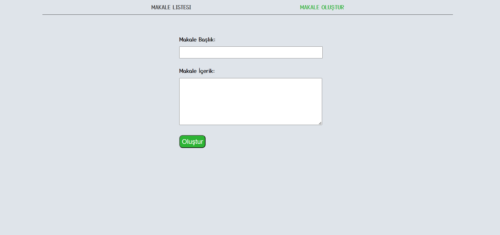
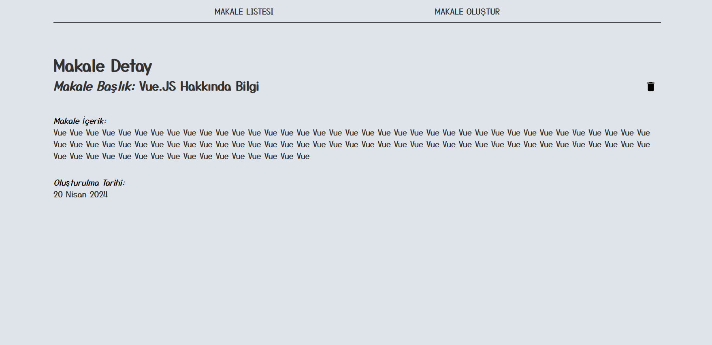

# Vue.js Firebase Blog Project

## Description
This repository hosts a simple Vue.js blog project integrated with Firebase for database functionality. The project allows users to view existing blog posts and add new ones. It serves as a foundational starting point for building more advanced blogging applications using Vue.js and Firebase.

## Key Features
- **Blog Viewing**: Users can browse through existing blog posts, viewing titles and content.
- **Blog Addition**: Users have the ability to add new blog posts, providing both title and content inputs.
- **Firebase Integration**: Firebase serves as the backend database for storing and retrieving blog data, ensuring real-time synchronization.
- **Responsive Design**: The user interface is designed to be responsive, offering optimal viewing across various devices and screen sizes.
- **User Authentication (Future Enhancement)**: Integration of Firebase Authentication for user management and authentication features can be added for enhanced security and functionality.

## Contributions
- Implemented Vue.js components and routing to create a dynamic user interface.
- Integrated Firebase Firestore for storing and retrieving blog data, ensuring reliability and scalability.
- Designed a clean and intuitive user interface with a focus on usability and aesthetics.
- Conducted thorough testing to identify and resolve any bugs or issues, ensuring a smooth user experience.

## Future Enhancements
- Addition of user authentication features using Firebase Authentication for enhanced security and user management.
- Implementation of search and filtering functionalities for easier navigation through blog content.
- Incorporation of rich text editing capabilities for blog content creation, allowing users to format text and add multimedia elements.
- Optimization of performance and scalability to accommodate a growing user base and increasing blog content.

This Vue.js Firebase blog project provides a solid foundation for creating dynamic and interactive blogging applications. Leveraging the power of Vue.js and Firebase, it offers a scalable and reliable solution for bloggers and content creators. Whether you're a beginner or an experienced developer, this project serves as an excellent starting point for building your own blogging platform.


# project-planner

## Project setup
```
npm install
```

### Compiles and hot-reloads for development
```
npm run serve
```

### Compiles and minifies for production
```
npm run build
```





